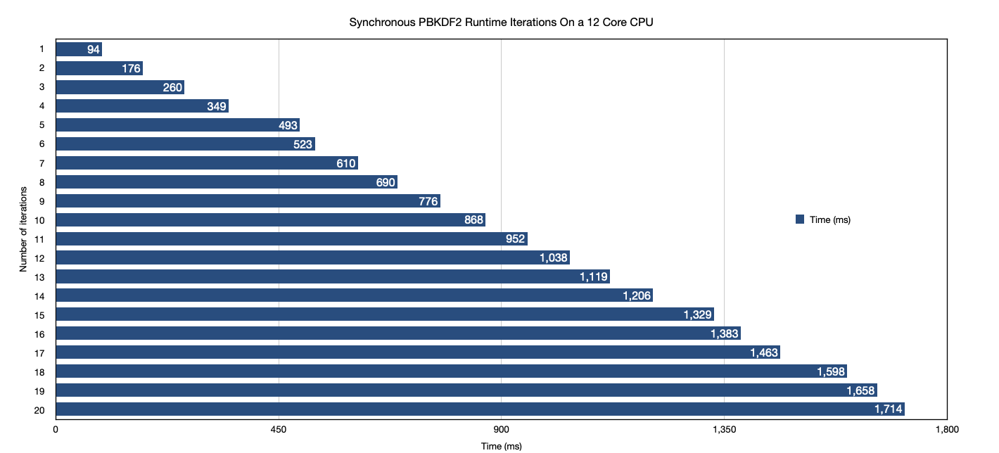
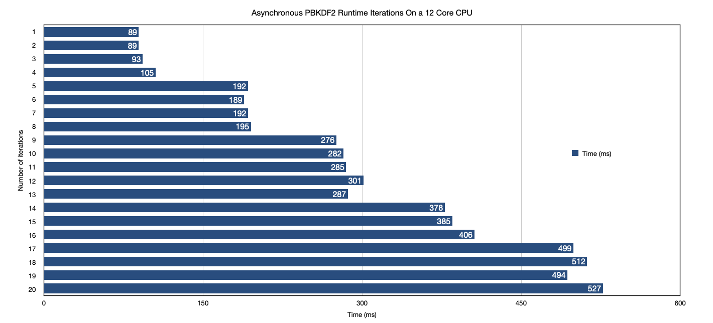

# NodeJS Thread Pool Performance Testing
The code in this repository is related to the following medium article:

```
https://medium.com/@ochedid95/nodejs-thread-pool-performance-limitations-33e77811ff5b
```

The password based key derivation function (pbkdf2) is called multiple times both synchronously and asynchronously. In each iteration, the computation time is displayed.

Here's is a visualization of the run time of both programs:

## Synchronous Calls

## Asynchronous Calls
